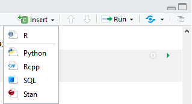

## 

Você irá entregar essa lista de exercício no Moodle da disciplina. Para isso, você irá submeter um único arquivo com as suas respostas que será feito usando a linguagem *markdown*. 

A vantagem de usar esse formato é que podemos escrever texto e código do R conjuntamente, e o R irá gerar um documento final com o texto formatado e os resultados da execução de todo o código. Se você quiser saber mais sobre *markdown*, veja esse [cheatsheet](https://www.rstudio.com/wp-content/uploads/2015/02/rmarkdown-cheatsheet.pdf) com os principais comandos ou entre na página [rmarkdown.rstudio.com](http://rmarkdown.rstudio.com) para mais informações. 


## Instruções


- Primeiro, instale o pacote do R `markdown`.

- Depois, salve o *template* [lista-01.Rmd](lista-01.Rmd) no seu computador no diretório apropriado.

- Ao abrir o arquivo com a extensão .Rmd no RStudio, ele deverá reconhecer automaticamente o formato e algumas opções específicas para esse arquivo estarão disponíveis. A parte superior do painel do *script* deverá ficar assim:

<div style= "float:center; position:relative; margin-left:20px">
```{r echo=FALSE, fig.align="center"}
knitr::include_graphics("img/header.png")
```
</div>

- Clique no botão **Knit** e selecione o formato em que você quer gerar o seu relatório (html, pdf ou word). O R irá gerar o arquivo na pasta em que você está trabalhando, e no formato solicitado. Abra o arquivo final e veja se está tudo ok. 

- Observe como a formatação do texto é simples. O código em R é organizado em **blocos de código** (ou *code chunks*) que começam com ` ```{r} ` e se encerram com ` ``` `. Você pode inserir esses delimitadores digitando no teclado, ou clicando no botão **Insert** na parte de cima do painel do script e selecionando a liguagem R.

<div style= "float:center; position:relative; margin-left:20px">
```{r echo=FALSE, fig.align="center"}

```
</div>

- Você também pode escrever nomes de objetos ou comandos do R na linha do texto usando os delimitadores ` `r ` `. 

- Ao gerar o arquivo final clicando no botão **Knit**, o R irá executar todos os seus comandos e incluir os resultados no relatório. Enquanto você estiver editando o seu arquivo, você pode executar separadamente cada linha de código no *console* do R ou clicando no botão **Run** acima.

- Agora é só editar o arquivo [lista-01.Rmd](lista-01.Rmd) direto no RStudio com as suas respostas para os exercícios abaixo. Quando terminar de responder, lembre-se de gerar o arquivo final novamente, conferir os resultados, e então submetê-lo no Moodle. `r emo::ji("+1")`


## Comandos Básicos no R


1) Qual é a diferença entre um objeto `data.frame` e um objeto `data.table` do pacote `data.table`? (Veja a documentação do *help* das funções).


2) Imprima o valor de log(4) com 15 dígitos.


3) Para quê serve a função `intersect`? O que retorna o comando:
`intersect( seq(4,28,by=7), seq(3,31,by=2) )`?


4) O que retorna o comando:
`c(TRUE,TRUE,FALSE,FALSE) & c(TRUE,FALSE,FALSE,TRUE)`? Explique porquê.


## Importando Dados

*(Cuidado ao imprimir objetos grandes no R. Lembre dos comandos `head` e `tail`.)*


1) Importe o arquivo [extremedatasince1899.csv](../datasets/extremedatasince1899.csv) no R. Crie um objeto chamado `sec20` com os dados de ciclones que ocorreram apenas entre 1900 e 2000.


2) Ordene o objeto `sec20` em ordem crescente de acordo com a variável velocidade do vento `Wmax`.


3) Calcule a média da velocidade do vento para a região (`Region`) `Basin`.


4) Faça um gráfico de dispersão da velocidade do vento por ano. Há alguma tendência de mudança da velocidade do vento ao longo do século XX?


## Resolução

Sugestão de respostas: [Resolução Lista 1](./resolucao/lista-01-resolucao.html)
